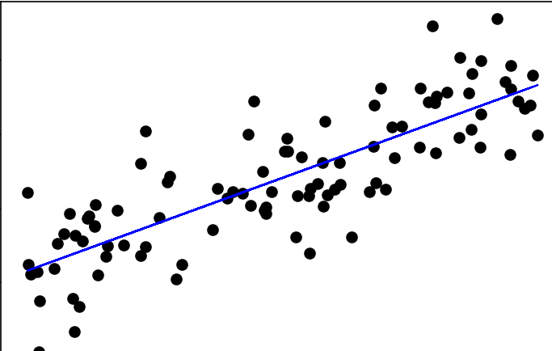
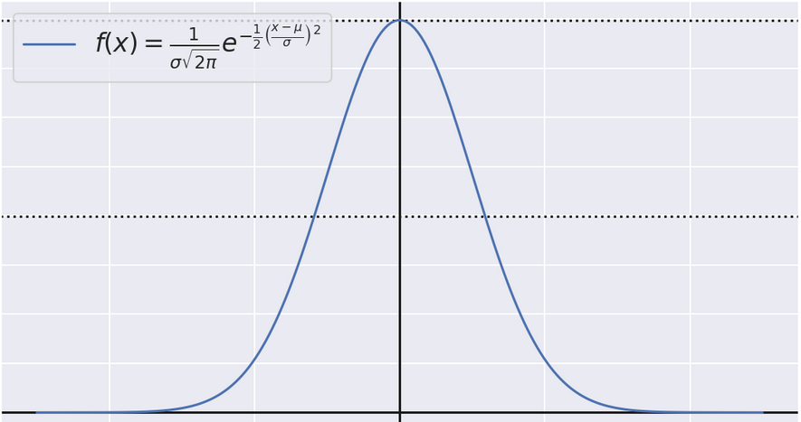

# Sammlung Physikbezogener Jupyter Notebooks
** Diese Sammlung enthält Jupyter Notebooks die im Physik alltag nützlich sind. Im foldenden kommen Vorschau zu den entsprechenden Notebooks und deren Anwendungsbezug. Die Notebooks selber sind dabei minimal gehalten, verständlich geschrieben, und Fertig für Copy and Paste.**

## Lineare Regession

## Nützliche Funktionen

